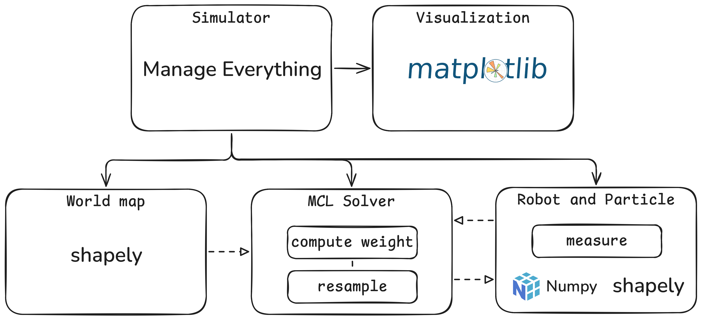
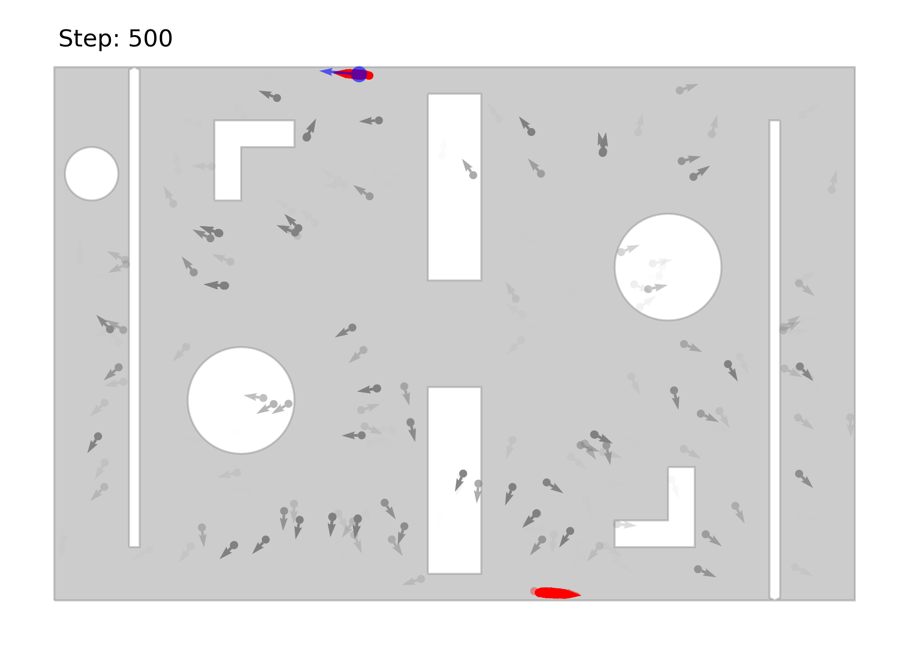

# Monte Carlo Localization (MCL) Robot Simulation

A Python implementation of Monte Carlo Localization for robot navigation in 2D environments with obstacles. This project simulates a robot using particle filters to estimate its position and orientation while navigating through a known map.

## Features

- **Monte Carlo Localization Algorithm**: Particle filter-based localization with configurable parameters
- **Robot Simulation**: Realistic robot movement with noise modeling
- **Sensor Simulation**: Distance sensor with measurement noise
- **Efficient Visualization**: High-resolution animation of robot and particle states and movement in resonable time
- **Flexible World Maps**: JSON-based map definition with obstacles

## Project Structure



```
├── simulator.py       # Main simulation engine, control and visualization logic
├── robot.py           # Robot and particle group implementations
├── mcl.py             # Monte Carlo Localization algorithm
├── worldmap.py        # World map handling
├── assets/            # Asset folder containing map definitions and related images
│   ├── map1.json
│   ├── map2.json
│   ├── map1_preview.png
│   └── map2_preview.png
└── README.md          # This file
```

## Quick Start

### Prerequisites

- **Python 3.12** (recommended)
- Required Python packages:
  - numpy
  - matplotlib
  - shapely
  - tqdm

Make sure these packages are installed in your environment before running the examples.

To get started:
```bash
git clone https://github.com/ANKer661/MCL-Simulator.git
cd MCL-Simulator
code .  # or open the project with your preferred editor
```

### Basic Usage

Refer to `noise.py` or `symmetric.py` in the `usage_example` directory.
To generate a video of the MCL process, run the following command:

```bash
python -m usage_example.symmetric
# or python -m usage_example.noise
```

### Map Creation

See `usage_example/map_creation.ipynb` for an example of map creation.

## Configuration Parameters

### Simulator Parameters

| Parameter                        | Description                                  | Default         |
|----------------------------------|----------------------------------------------|-----------------|
| `world_map`                      | World map object                             |                 |
| `control_node`                   | Motion control input                         |                 |
| `num_particles`                  | Number of particles in the filter            |                 |
| `init_x`, `init_y`, `init_theta` | Robot's initial position and orientation     |                 |
| `robot_radius`                   | Robot's physical radius                      |                 |
| `sample_radius`                  | Particle sampling radius                     |                 |
| `sensor_max_distance`            | Maximum sensor range                         | 100             |
| `likelyhood_sigma`               | Likelihood function standard deviation       | 10              |
| `measurement_sigma`              | Sensor measurement noise                     | 1               |
| `ema_alpha`                      | Exponential moving average smoothing factor  | 0.9             |
| `v_sigma`, `w_sigma`             | Motion model noise parameters                | 0.1             |
| `resample_factor`                | Resampling threshold (fraction of particles) | 0.5             |
| `resample_random_probability`    | Random resampling probability                | 0.1             |
| `fps`                            | Frames per second for simulation rendering   | 30              |
| `speedup`                        | Simulation speed multiplier                  | 1               |
| `dpi`                            | DPI for video rendering                      | 100             |
| `save_file_name`                 | Output video file name                       | "simulation.mp4"|
| `add_size_bar`                   | Whether to render a size scale bar           | False           |
| `random_seed`                    | Random seed for reproducibility              | 0               |


### Control Node Parameters

| Parameter       | Description                           | Default |
| --------------- | ------------------------------------- | ------- |
| `max_linear`    | Maximum linear velocity               | 10.0    |
| `max_angular`   | Maximum angular velocity              | 2.0     |
| `safe_distance` | Obstacle avoidance distance           | 30      |
| `turning_step`  | Steps to turn when avoiding obstacles | 1000    |


## Animation Output

The simulator generates:
- **MP4 Animation**: Real-time visualization of the MCL process

### Visualization Elements



- **Blue Circle**: Real robot position and orientation
- **Red/Gray Particles**: Particle filter estimates
  - Red: High-confidence particles (survived ≥10 resampling cycles)
  - Gray: Regular particles
  - Transparency: Particle weight/confidence
- **Gray Areas**: Free space.
- **White Areas**: Obstacle.


